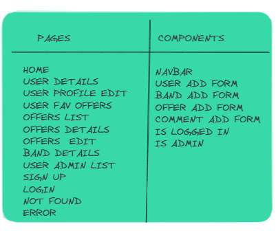

## [INFO MUSIC JOB](https://infomusicjob.netlify.app/)

## Descripción

- Info Job Music, una web de búsqueda de trabajo en bandas y grupos musicales para aquellos artistas los cuáles quieren demostrar su talento a todos aquellos que asistan a los eventos musicales.

## Funcionalidad a Implementar

- Tengo que decir, que me gustaría haber podido implementar diferentes funcionales algunas que tenía pensadas como Bonus e incluso otras para la base de proyecto, pero por tiempo no ha sido posible. Algunas de ellas son:

- Que el admin de la banda pueda aceptar o rechazar a los candidatos a la oferta creada.

- Que una vez aceptado el admin tu solicitud de inscripción, apareciera tu nombre en los componentes del grupo.

- Implementar reseñas en los perfiles del usuario para mejorar la experiencia entre la comunidad, recomendando y valorando el arte y trabajo de los artistas.

- Más y mejores restricciones y validaciones mejoradas en los formularios.

## Tecnologías usadas

Las tecnologías usadas mayormente son: HTML, CSS, Javascript, Express, React, axios, React Context, Bootstrap.

## Estructura del Cliente

- /signup: el usuario al acceder a la web deberá registrarse si no tiene una cuenta debido a que la web excepto la página de inicio, las demás vistas son privadas solo para usuarios activos. 

- /login: el usuario dispone una vista de inicio de sesión dónde introduciendo sus credenciales correctamente accederá a la web. 

- /list-users: solo el usuario como administrador podrá acceder a esta vista dónde ve una lista detallada de usuarios y puede eliminarlos.  

- /bands: solo el usuario como administrador podrá acceder a esta vista dónde ve una lista de todas las bandas existentes y podrá eliminarlas.  

- /offers: esta es la vista principal que se encuentra en la página de inicio dónde el usuario puede ver las diferentes ofertas y acceder a los detalles de esta. 

- /my-profile: el usuario accede a un perfil personal dónde se mostrarán sus datos. 

- /update: el usuario accederá a esta vista para poder editar algunos datos de su información personal. 

- /:bandId/details/createOffer: el usuario podrá crear ofertas que están asociadas a la banda creada por el mismo. 

- /offer/:id/details: el usuario podrá ver los detalles de la oferta. 

- /offer/:id/edit: el usuario podrá editar la oferta. 

- //band/:id/details:  el usuario podrá ver los detalles de una banda. 

- /band/:id/edit: el usuario podrá editar la banda. 

- /band/create: el usuario podrá crear una banda. 

Aquí muestro una imagen de mi organización inicial sobre el proyecto, con sus diferentes páginas y componentes, esta ha sido modificada sobre el transcurso del mismo. 

## Contexto

- auth.Context

- isUserActive.Context

- role.Context

- activeUser.Context

## Enlaces 

- [Developer Antonio Navas Barbado](https://github.com/antoniionavas)

## Proyecto

- [Enlace repositorio cliente](https://github.com/antoniionavas/my-app-client.git)

- [Enlace repositorio server](https://github.com/antoniionavas/my-app-server.git)

- [Enlace Deploy](https://infomusicjob.netlify.app/)

## Trello

- [Tablero Trello](https://trello.com/b/gf88plk2/tasks)

## Diapositivas

- [Presentación](https://docs.google.com/presentation/d/1Wr-2L-nNzwh1Incfqu3QBooMuO7z8otSsIlXscCGIzU/edit?usp=sharing)
